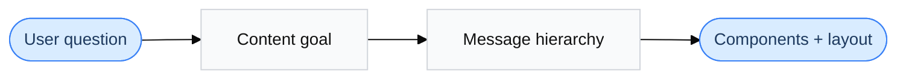
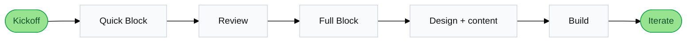

# The framework

Figure out what the content needs to do — before anyone argues about wording or layout.

  <strong>New here?</strong> Try Build a page — it walks you through it.
  <a href="/examples/page-assembler" class="callout-link">Build a page →</a>

## Core principles

<strong>The user question is everything</strong>

The most important thing on any page is what the user came to figure out.

<strong>The content goal drives decisions</strong>

Once the goal is clear, every other decision follows from it.

<strong>Strategy shapes the words</strong>

What to say gets decided independently from how to say it.

<strong>Structure reflects meaning</strong>

Information hierarchy is intentional, not inherited from a template.

<strong>Edge cases aren't optional</strong>

The happy path is never the full story.

<strong>Works across every discipline</strong>

Content, design, product, and research should all find it useful.

## How the thinking flows

## How a project flows

## The model

User need
What they're asking

Fields

<ul class="model-fields">
<li>User question</li>
<li>User intention</li>
<li>Problem statement</li>
<li>Jobs to be done</li>
<li>Why it matters</li>
<li>Thinking / feeling</li>
</ul>

Ask yourself

<ul class="model-questions">
<li>Is the user question clear enough that someone new to the project could understand it?</li>
<li>Is the problem statement grounded in both user and business reality?</li>
<li>Are the jobs to be done specific enough to act on?</li>
</ul>

Strategy
What it needs to do

Fields

<ul class="model-fields">
<li>Content goal</li>
<li>Experience goal</li>
<li>Business goal</li>
</ul>

Ask yourself

<ul class="model-questions">
<li>Is the content goal clear enough to explain in one sentence?</li>
<li>Do the content, experience, and business goals each say something different?</li>
</ul>

Messaging
What to say

Fields

<ul class="model-fields">
<li>Key messages</li>
<li>Message hierarchy</li>
</ul>

Ask yourself

<ul class="model-questions">
<li>Are the key messages easy to understand?</li>
<li>Is the hierarchy intentional — or did things just end up in that order?</li>
</ul>

Experience design
How it works

Fields

<ul class="model-fields">
<li>Required components</li>
<li>States and edge cases</li>
<li>Dependencies</li>
<li>Terminology guidance</li>
</ul>

Ask yourself

<ul class="model-questions">
<li>Are the components tied back to the strategy?</li>
<li>Are states and edge cases covered?</li>
<li>Are dependencies spelled out?</li>
</ul>

Notes
Risks and open questions

Fields

<ul class="model-fields">
<li>Risks and constraints</li>
<li>Open questions</li>
<li>Success signals</li>
<li>Metrics</li>
</ul>

Ask yourself

<ul class="model-questions">
<li>What could go wrong?</li>
<li>What is still unknown?</li>
<li>How will we know this is working?</li>
</ul>

Metadata
How it's tracked

Fields

<ul class="model-fields">
<li>Name</li>
<li>Surface / page / flow</li>
<li>Journey stage</li>
<li>Audience</li>
<li>Owner</li>
<li>Status</li>
</ul>

Ask yourself

<ul class="model-questions">
<li>Is this easy to find later?</li>
<li>Is the status current?</li>
</ul>

## Ways to work

| Approach | Best for |
|---|---|
| **Workshop** | Fast alignment with real-time input |
| **Phased sessions** | Complex work that needs a tight starting loop |
| **Solo draft → share** | One person with strong context, opened for review |

## Vocabulary

Journey stage

Discover · Compare · Decide · Set up · Manage · Review

Audience

New user · Existing user · Supported user · Self-directed user

Status

Draft · In review · Approved · Archived

Research confidence

Low · Medium · High

Content goal examples

Orient the user quickly · Explain a decision clearly · Reduce confusion · Highlight a next step · Build confidence in an action

Trigger examples

New product launch · Redesign of an existing page · Cleaning up inconsistencies across page types

## Ready to use it?

Build a page puts the framework into practice — one block at a time.

<a href="/examples/page-assembler" class="btn-hero-primary">Build a page →</a>

